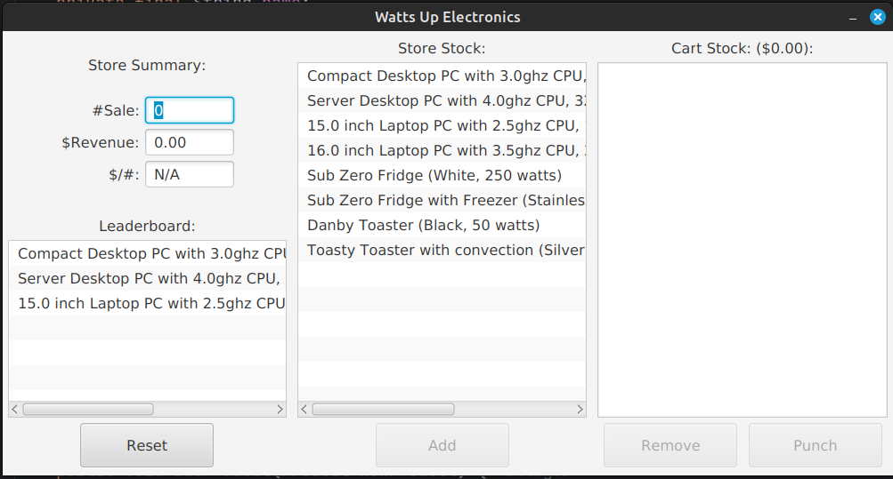

# Electronic Store Management App

This is a desktop GUI application developed in Java to help a store manage its onsite customers easily. The application uses Object-Oriented Programming (OOP) principles and follows the Model-View-Controller (MVC) pattern to implement the GUI surface over the main business logic.

## Features

- Track shop's inventory
- Give Sales Overview
- Help to sell items from inventory via cart
- User-friendly interface
- Top products leaderboard

## Screenshot



## Requirements

- Java Development Kit (JDK) 8 or higher
- JavaFX SDK

## Installation

1. Clone the repository:
    ```sh
    git clone <repository-url>
    ```
2. Navigate to the project directory:
    ```sh
    cd <project-directory>
    ```

## Compilation and Execution

1. Compile the application using JavaFX:
    ```sh
    javac --module-path /path/to/javafx-sdk/lib --add-modules javafx.controls,javafx.fxml -d bin src/*.java
    ```
2. Run the application:
    ```sh
    java --module-path /path/to/javafx-sdk/lib --add-modules javafx.controls,javafx.fxml -cp bin Main
    ```

Replace `/path/to/javafx-sdk` with the actual path to your JavaFX SDK.

## Contributing

Contributions are welcome! Please fork the repository and submit a pull request.

## License

This project is licensed under the MIT License.